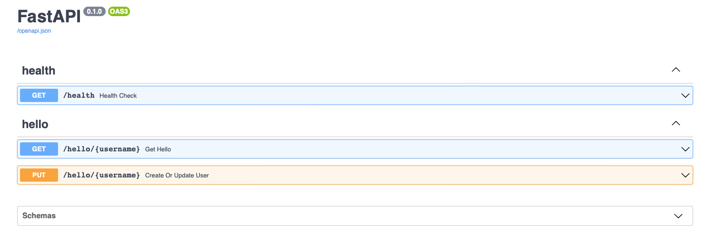

# Hello World microservice :rocket:

<div align="center">

<!---
[](https://circleci.com/gh/...)
[](https://codecov.io/gh/.....)
[](https://codeclimate.com/repos/....)
-->


[](https://github.com/art049/fastapi-odmantic-realworld-example/actions/workflows/ci.yml)

[](https://github.com/python/black)
[](http://mypy-lang.org/)


</div>

> ### The application codebase using [FastAPI](https://github.com/tiangolo/fastapi) + [SQLAlchemy](https://github.com/sqlalchemy/sqlalchemy) to expose HTTP-based APIs. Current setup is designed supports [Google Cloud Platform](https://cloud.google.com) services and the infrastucture is managed by [Terragrunt](https://terragrunt.gruntwork.io)(IaC).


Project Organization :open_file_folder:
------------

    │
    ├── README.md
    ├── /.devcontainer
    │   ├── /library-scripts                        <- install scripts for devcontainer
    │   ├── cloudrun.env                            <- parameters for GCP environment
    │   ├── cloudrun.env                            <- devcontainer env variables
    │   ├── devcontainer.json                       <- devcontainer configuration
    │   ├── docker-compose.devcontainer.yml         <- devcontainer compose file for PSQL service
    │   └── Dockerfile                              <- container file
    ├── /.github
    │   └── /worfklows                              <- GitHub Actions files
    ├── /.vscode
    │   ├── launch.json                             <- IDE Debugger configuration
    │   └── settings.json                           <- IDE settings
    ├── /docs                                       <- Documentation of details
    ├── /scripts
    │   ├── build.sh                                <- local container image builder
    │   ├── clean.sh                                <- remove local container
    │   ├── common.sh                               <- shared variables for scripts
    │   ├── infra-prod.sh                           <- infrastucture deployment
    │   ├── init-gcloud.sh                          <- set credentials for GCP project
    │   ├── init.sh                                 <- install application required lib(s)
    │   ├── preview.sh                              <- deploys application for review with url
    │   ├── production.sh                           <- route traffic of application url to the reviewed version of application 
    │   ├── start.sh                                <- start application in local built container
    │   └── test.sh                                 <- application unit tests
    ├── /src
    │   ├── /core
    │   │   ├── __init__.py
    │   │   ├── exceptions.py                       <- ORM exceptions
    │   │   └── user.py                             <- Implemented ORM methods for 'User' model
    │   ├── endpoints
    │   │   ├── __init__.py
    │   │   └── hello.py                            <- Endpoint HTTP API implementation
    │   ├── models
    │   │   ├── __init__.py
    │   │   └── user.py                             <- 'User' model implementation
    │   ├── schemas
    │   │   ├── __init__.py
    │   │   ├── base.py                             <- Base configuration for requrest and response schemas
    │   │   ├── hello.py                            <- 'hello' endpoint response schema(s)
    │   │   └── user.py                             <- 'user' request schema(s)
    │   ├── __init__.py
    │   ├── api.py                                  <- Main python file to run the app
    │   └── settings.py                             <- Application settings handler
    ├── terragrunt
    │   ├── _envcommon                              <- Environments shared parameters
    │   │   ├── cloudrun.hcl
    │   │   └── database.hcl
    │   ├── _resources                              <- Terraform modules
    │   │   ├── cloudrun
    │   │   │   ├── main.tf
    │   │   │   └── vars.tf
    │   │   └── database
    │   │       ├── main.tf
    │   │       ├── outputs.tf
    │   │       └── vars.tf
    │   ├── prod                                    <- Production environment
    │   │   ├── europe-west3
    │   │   │   ├── prod
    │   │   │   │   ├── cloudrun
    │   │   │   │   │   └── terragrunt.hcl
    │   │   │   │   ├── database
    │   │   │   │   │   └── terragrunt.hcl
    │   │   │   │   └── env.hcl
    │   │   │   └── region.hcl
    │   │   └── project.hcl
    │   ├── readme.md
    │   └── terragrunt.hcl                          <- Main terragrunt file
    ├── tests
    │   ├── conftest.py                             <- HTTP TestClient
    │   ├── test_endpoints.py                       <- HTTP endpoint tests
    │   ├── test_models.py                          <- Model(s) function(s) test
    │   └── test_schemas.py                         <- Schema(s) validator(s) test
    ├── CHANGELOG.md
    ├── mypy.ini
    ├── project.toml
    ├── pytest.ini
    ├── requirements.txt                            <- Requirements file with the list of the libraries needed
    └── test-requirements.txt                       <- Requirements file with the list of the libraries needed for testing

## Consult the API documentation :books:
To consult the API documentation just type the following address in a browser.

```
http://localhost:8080/docs/
```



**Endpoints available at `http://localhost:8080/{URI}`**:

|Method|URI|Description|
|------|---|-----------|
| GET | /docs | Application API swagger UI |
| GET | /health | Application healthcheck endpoint |
| GET | /hello/{username} | Retrieve data from the DB given an username |
| PUT | /hello/{username} | Insert or Update user data in the DB |
| GET | /openapi.json | OpenAPI schema definition |

Run the microservice with the command:
```
./scripts/start.sh
```

**Details of documentation** is at [/docs](/docs) folder

## Getting Started

### :hammer: Devlopment

- [Install Visual Studio Code](https://code.visualstudio.com/download) with [Dev Containers](https://marketplace.visualstudio.com/items?itemName=ms-vscode-remote.remote-containers) extension
- [Install Docker](https://docs.docker.com/engine/install/) (necessary to run as a container instance)
- [Open folder](https://code.visualstudio.com/docs/remote/containers#_quick-start-open-an-existing-folder-in-a-container) in container

**more details** is at [development documentation](/docs/development.md)

### :bulb: Useful scripts

- Init credentials for deployments: `./scripts/init.sh`
- Deploy infrastucture into GCP: `./scripts/infra-prod.sh`
- Deploy application for preview: `./scripts/preview.sh`
- Switch preview to production: `./scripts/production.sh`

**more details** is at [scripts documentation](/docs/scripts.md)
## Coming Soon

- [ ] Pipelines
- [ ] Deployment on GCP with MongoDB Atlas
- [ ] Performance measurements